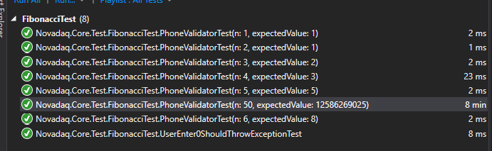
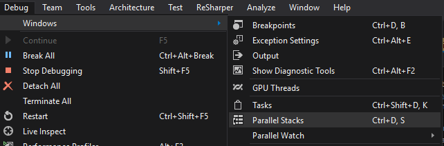

## Project structure
* **Novadaq.Core** : Shared code library targeting NetStandard 2.0
  * This project depends on [System.Reative](https://www.nuget.org/packages/System.Reactive/). 
It will be restored automatically by Nuget Package Manager if the project is built by Visual Studio
  * This project contains:
    * `FibonacciFinder`: a static class provides a recursive method to find Fibonacci number. 
    This method is not optimized in order to demonstrate how the threading management done in FileWatcher.
    Inded, the ammount of time it takes to calculate Fibonacci(50) is 8 minutes as in this picture
    
        
    * `FileWatcher`: The file watcher represent a session with a given observed folder.
    Whenever a new folder is given a new instance of FileWatcher should be created.
    This file watcher uses [Task Parallel Libary (TPL)](https://docs.microsoft.com/en-us/dotnet/standard/parallel-programming/task-parallel-library-tpl)
    to schedule tasks that will be excuted by the default task scheduler (ThreadPool).
    The task will be interupted using CancellationTokenSource which is explained in [Cancellation in Managed Threads](https://docs.microsoft.com/en-us/dotnet/standard/threading/cancellation-in-managed-threads).
    When the user asks to observe the folder, a new task will be spawn and run in the while loop to look for a file named `input` in the given folder.
    If the user decides to terminate the task, the cancellation token will be propagated correctly to cancel all outstanding tasks.
    By using TPL, the input observation runs on a seperate thread and don't block the main thread at all. 
    Even when the Fibonacci is calculated, the current task will spawn the new task, schedule a callback by using `await` keyword and return the current thread to threadpool.
    The whole behavior could be observe using breakpoint at a certain stages; when a break point is hit, use `Parallel Stacks` and `Tasks` windows under `Debug/Windows` menu.
        
        

        The `FileWatcher` uses [ReactiveX](https://github.com/Reactive-Extensions/Rx.NET) to provide a fluent IObservable to signal any event happens in the process.

   
* **Novadaq.Core.Test** : xUnit test project for testing Novadaq.Core.
* **Novadaq.UI** : UI application using WPF targeting .Net Framework 4.7.
  * The UI thread is not blocked by the `FileWatcher` and `FibonacciFinder`.
    Indeed, the UI thread is free to do any operation even cancelling the running task for file observation and Fibonacci finding.

## Requirement
* Visual Studio 2017 version 15.3. Download the free community version at [https://www.visualstudio.com/thank-you-downloading-visual-studio/?sku=Community&rel=15](https://www.visualstudio.com/thank-you-downloading-visual-studio/?sku=Community&rel=15)
Make sure the `.Net Desktop Development` and `.Net Core Cross-platform development` workload is installed.
Also choose `.NET Framework 4.7 SDK` and `.NET Framework 4.7 targeting pack` in `Individual components` to be able to build the WPF project. 

## Time reports
|Task               |Time
|-------------------|----------|
|Designing code     | 30 minutes
|Implement code     | 1.5 hours
|Debuging and test  | 1.5 hours
|Documentation      | 1 hours
